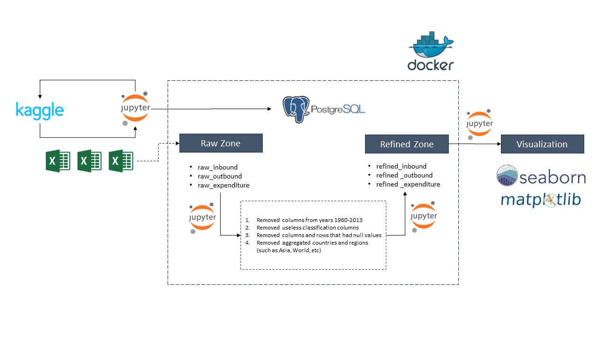
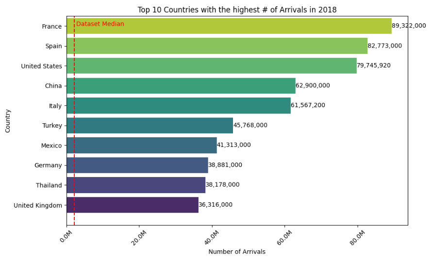
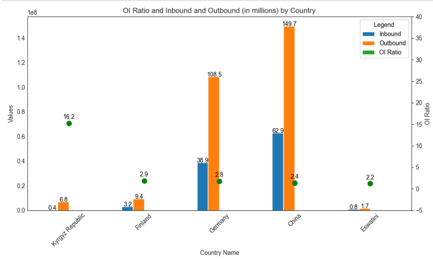
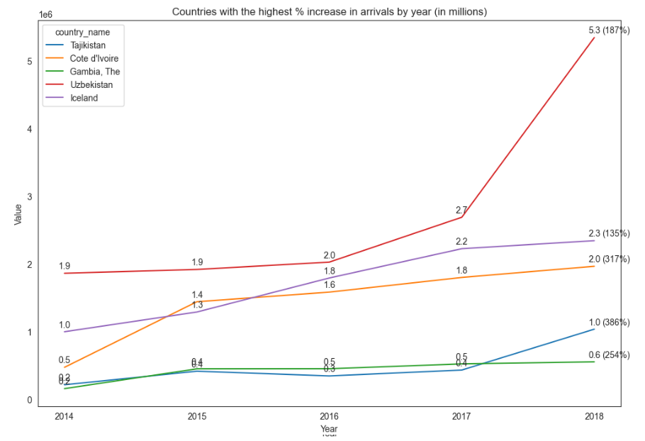
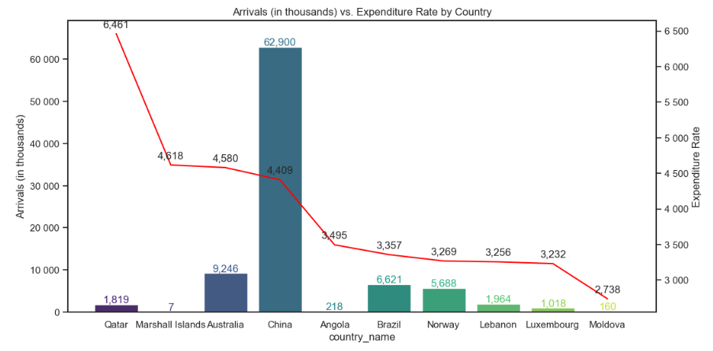

# travel-dataset-exploration
The purpose of this repository is to explore a public travel dataset while testing basic ETL and visualization techniques with matplotlib and seaborn.

## Challenge

Build an ETL chain to design and deliver the data model that would cover a certain area of human knowledge or answer a specific question, creating a report that would state the problem and demonstrate your findings.

## Deliverables

- data source files;
- jupyter notebook, including:
    - the code for your ETL chain;
    - documentation of your pipeline, including a detailed explanation of the data flow, data cleansing, transformations, and lookups;
    - documentation of the data cube design and your reasoning behind it;
- the final report with your findings and visualizations.

### 1. Data source files

I have decided to use the [International Tourism Demographics Kaggle dataset](https://www.kaggle.com/datasets/ayushggarg/international-tourism-demographics) given my passion for travelling and the opportunity of learning more about industry numbers. The dataset files are duplicated in this repository under the dataset folder. It is a fairly simple dataset with only 3 light CSV files:

*1. International inbound tourists (overnight visitors):* are the number of tourists who travel to a country other than that in which they usually reside, and outside their usual environment, for a period not exceeding 12 months and whose main purpose in visiting is other than an activity remunerated from within the country visited. When data on the number of tourists are not available, the number of visitors, which includes tourists, same-day visitors, cruise passengers, and crew members, is shown instead.

*2. International outbound tourists:* are the number of departures that people make from their country of usual residence to any other country for any purpose other than a remunerated activity in the country visited. The data on outbound tourists refer to the number of departures, not to the number of people traveling. Thus a person who makes several trips from a country during a given period is counted each time as a new departure.

*3. International tourism expenditures:* are expenditures of international outbound visitors in other countries, including payments to foreign carriers for international transport. These expenditures may include those by residents traveling abroad as same-day visitors, except in cases where these are important enough to justify separate classification. For some countries, they do not include expenditures for passenger transport items. Data are in current U.S. dollars.

More complex projects that deal with heavier datasets or joins between tables can be found in my github:

1 - [11 GB dataset ingestion in AWS](https://github.com/mcanabrava/data-engineering-aws-mba-fiap) <br></br>
2 - [Staging and Loading multiple tables in Redshift](https://github.com/mcanabrava/udacity-aws-data-engineering/tree/main/2.%20Cloud%20Data%20Warehouses)

### 2. Jupyter notebook

The code for this project is inside the notebook folder. However, it is first necessary to set up a postgres container using docker to better replicate a production work environment. To try the project, please follow the steps below:

1. Start docker compose in the current directory by running docker-compose up
2. Create a new virtual env by using your way of choice

For example, I'm currently running virtualenv on Windows with:

```
virtualenv travelenv
travelenv\Scripts\activate
```

3. Install the required packages by running pip install -r requirements.txt <br></br>
4. Open the notebook and run the cells to create and load the raw postgres tables, load cleaned data into the refined tables, and finally load data into the aggregated tables that are used for the data visualizations.

#### Architecture Design



Postgres database usage is not a requirement or an advantage in the context of the current dataset, as we could run the same data explorations and visualizations directly in the Jupyter Notebook. However, Postgres is being used solely for demonstration purposes in case there was the actual need to store the CSVs information for later user consumption. 

The same applies for the tables we are using inside Postgres, as they could be contained inside dataframes with different names. The aim of creating a raw and a refined layer is to mantain a backup of the data in it's raw state after ingestion and after the necessary transformations. A trusted metrics layer could also be used to provide aggregated information from the individual tables or their combinations. 

Seaborn and matplotlib were chosen to build the visual explorations for the dataset as I didn't have a lot of experience on them and decided this was a good opportunity to familiarize myself with these libraries. On the other hand, a clear improvement point here would be to add a professional BI tool to create the visualizations, such as a docker-compose version of metabase.


### 3. Final report

Key Insights:

1. France, Spain and the U.S led 2018 arrivals with around 90 million arrivals each, a figure almost 3x higher than the U.K (ranking #10), and 45x higher than the dataset median, pointing to a very concentrated global tourism market.



2. Although China and Germany are both in the top 10 countries in number of arrivals, they also have a significant number of departures, being under the top 5 outbound/inbound ratio countries with 2x and 3x more departures than arrivals, respectively. Kyrgyzstan deserves special attention and a follow-up investigation as it has the highest O/I ratio with a 5x difference from the Finland, in the second place. What is going on with Kyrgyzstan?



3. On the other hand, Taijikistan leads the Top 5 of Highest Arrivals/Departure ratios. Why are so few people departuring from the country? Would it be because of missing data, limited infrastructured, or political conditions? Dominican Republic, Croatia, and Portugal are not a surprise in this chart given the small size of these countries compared to their touristic popularity.


4. Continuing the investigation about Taijikistan, we can see that despite the low absolute number of arrivals, they have been growing at a fast rate, positioning the country on the top #1 in terms of arrival growth rate during 2014-2018 with an increase of almost 400%. 



5. A key part of the tourism industry is the number of visitors in each country, but is equally or even more important than that how much each tourist is spending. Qatar leads the way with 6.461 USD spent/arrival, almost twice as much as the other top 9 countries. Australia and China are able to capture a lot of money from tourists, considering that they combine both spending and high number of tourists. Brazil and Angola are a surprise to me, given that they have weaker currencies and it might be harder to spend a high ammount of dollars.



Please check the notebook for 5 additional charts and insights. 

## Improvement notes and next steps

As the goal of this exercise is to finish the data exploration under a limited ammount of time, I have restricted myself to developing basic analytics functionalities, but I would like to highlight improvement opportunities in case more time and resources were available:

*1. Code Quality*
    - Simplify raw tables ingestion in the raw zone using the copy command inside the load_raw_tables.sql instead of SQL Alchemy and reduce code lines using the DRY principle to avoid repeating code in multiple cells
    - Simplify refined tables ingestion using the same strategy
    - Export custom functions to a separate python file
    - Export SQL queries to a separate file
*2. Pipeline Orchestration*
    - Not useful considering the context of yearly data, but in case we were dealing with monthly or daily ingestion we could break jupyter notebook code down into different python files and schedule daily jobs for each step inside the notebook file, or use an orchestrator such as Airflow as demonstrated in one of my previous [github projects](https://github.com/mcanabrava/udacity-aws-data-engineering/tree/main/4.%20Data%20Pipelines%20with%20Airflow)
*3. Data Quality*
    - Data Quality operators could be implemented directly in the orchestrator, such as inside an Airflow DAG
    - Alternatively, simple python scripts with the solo purpose of printing logs could be used to check for completeness, accuracy, consistency, integrity and other dimensions. Examples include logs for counting the number of null values, duplicated rows, checks between the number of arrivals and departures, and value checks between the raw and refined layers.
*4. Query Performance and Cost Saving*
    - An additional "metrics layer" with aggregated information could be built upon the refined layer to consolidate aggregated business information so end users could simply read from the table in their BI system of choice instead of making the BI run the calculations by itself, which is both more expensive and less performatic. However, due to the small volume of the dataset this was not executed.
*5. Data Visualization*
    - Additional analysis such as: 
        - ingest the total number of inhabitants of each country to determine the countries with the highest and lower percentual rates of inbound and outbound travellers, assuming  departures and arrivals are a good proxy for travellers.
        - find out the average yearly spent per inhabitant in foreign countries, considering the full population data
        - on the other hand, understand the average collection per inhabitant given total foreigners expenditure in each country
        - what were the years with a record high or low on arrival/departures? how far are these records from the average numbers?
    - Connect Postgres to a professional BI tool such as Metabase to allow non technical users to run their own analysis and have better looking dashboard with additional functionalities
*6. Business Alerts*
    - In case business monitoring was useful, alarms could be added directly into the BI tool, to send a slack message or email to the relevant group of people when the number yearly, monthly, or weekly visitors in a certain country or any of the previous mentioned metrics goes above or beyond a certain threshold, for example.